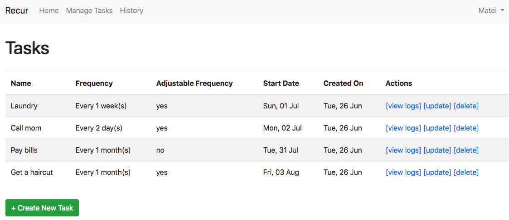
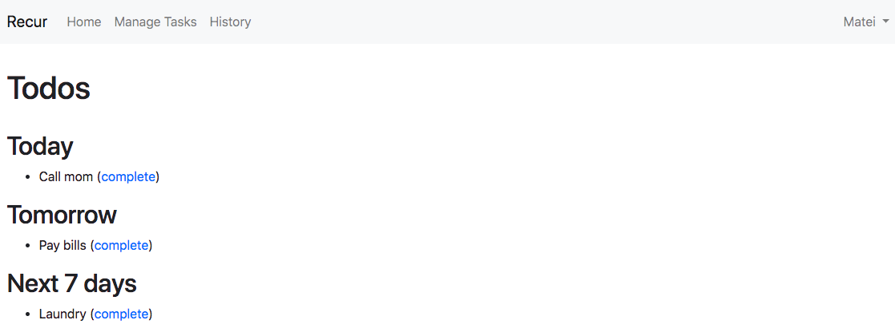

# Recur

A todo manager for recurring tasks.

## Description

### Usual process

1. You register an account
1. You then create a list of tasks, along with their frequency (every 2 days, every 1 week) and start date
1. The dashboard will show a todo list for today, tomorrow and rest of the week

### Screenshots

Task Manager Page:


Dashboard:


### Notes

- Tasks can have their due date either fixed (every Monday, every 3rd of the month etc) or adjustable on completion (if
I have to shave every Monday and i shave on a Friday, my next due date will be next Friday, as Monday would be too early)

## Installation

```
git clone git@github.com:mateicarpen/recur.git
cd recur

composer install

# modify the .env file to suit your needs (you will need database details)

php bin/console doctrine:migrations:migrate

npm install
```

## Technologies used

- Symfony 4.1